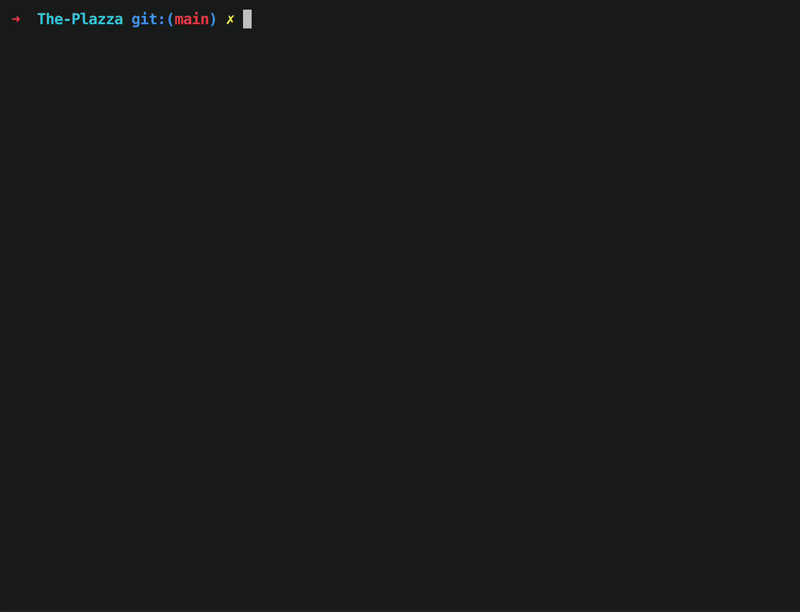
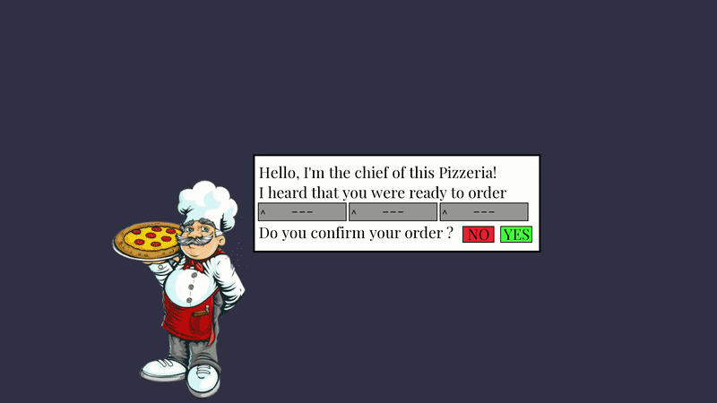

# The-Plazza (v0.1)

### Preview


Normal usage


Graphical usage

### Development
By *Pierrick Simon*(pierrick.simon@epitech.eu) & *Ariel Amriou*(ariel.amriou@epitech.eu)

## Objective

The objective of this project is to simulate a pizzeria, with adaptative kitchens (represented by processes) and cooks (represented by threads).

## Getting Started

### Prerequisites

This project requires the following dependencies:

- **Programming Language:** C++
- **Package Manager:** CMake
- **Graphical Library (optional):** SFML

### Linux installation

1. **Clone the repository:**

```sh
git clone git@github.com:pierrick-simon/The-Plazza.git
```

2. **Navigate to the project directory:**

```sh
cd The-Plazza
```

3. **install dependencies:**

```sh
sudo apt-get install libsfml-dev
```

## Documentation

If you'd like to contribute to this project, please look after the **docs/developper_doc.md**

## License

This project is licensed under the **Creative Commons Attribution-ShareAlike 4.0 International License** (CC BY-SA 4.0 DEED).


