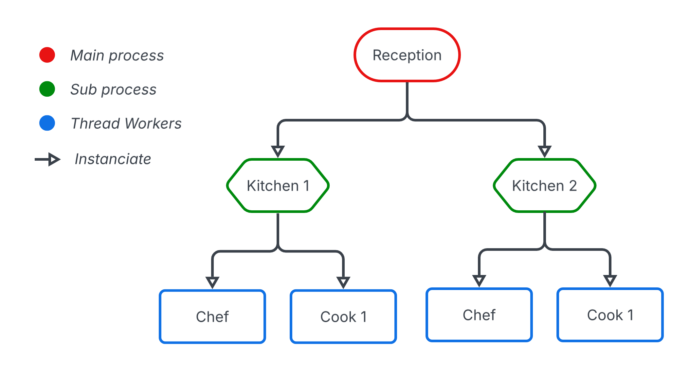

# Developper Documentation

## Logic diagram

As you can see in the upper image, there are three major part to understand.

First, the Reception (main process), which handle the shell and the communication with the kitchens. Therefore, it orchestrate the kitchens, creating new one when needed, and dispatching pizza requested by the shell in the existing kitchens. Lastly, the reception handle the *status* command by asking the kitchens there status and printing it.

In a second place, the kitchens (sub process), have a predifined number of cooks, created at the construction, which have a queue of pizzas requested by the reception. The kitchen's ingredient stock is refilled by a fixed thread named Chef.

Lastly, the cook (thread worker), takes the pizza from the kitchen's queue, takes the corresponding ingredient, and wait the corresponding time before notifying the kitchen.